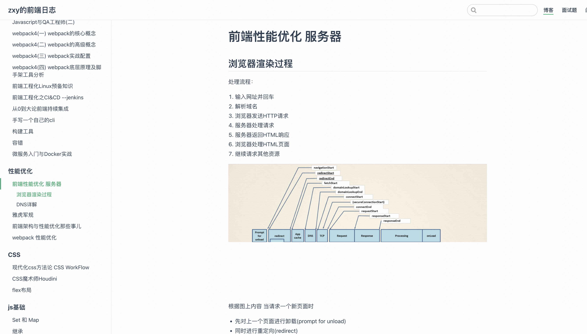

## Github page个人博客开发

### 一、产品设计

#### 1、产品功能：

**（1）个人主页** 

**（2）文档分类浏览（左侧目录树、右侧对应的markDown）**

（3）搜索功能

（4）用户登陆、用户权限

（5）评论功能

（6）在线管理文档功能（新增、删除、修改，只有管理员有权限）

（7）私人笔记功能（只有管理员能访问）

**（8）数据记录功能：关键日志记录、数据统计（总访问量、每篇文档访问量）**


### 二、UI设计

#### 1、主页


#### 2、文档页




### 三、技术方案


#### 1、Gitpages使用

官方基础使用文档：https://docs.github.com/zh/pages/quickstart

第三方介绍：https://sspai.com/post/54608

部署react项目： https://github.com/gitname/react-gh-pages


2、view层级设计（react）

（1）主页page 

HomePageView

-rootContainer 根容器

  --backGroundContainer 背景容器

  --topViewContainer 顶部容器

   ---leftViewContainer 左对齐容器

​     ----itemView

   ---rightViewContainer 右对齐容器

​     ----itemView

  --middleViewContainer 中间容器

​    ---view1Container

​    ---view2Container

​    ...

  --bottomViewContainer 底部容器（待拓展）


（2）文档页

DocsPageView

-rootContainer 根容器

  --topViewContainer 顶部容器

   ---leftViewContainer 左对齐容器

​     ----itemView

   ---rightViewContainer 右对齐容器

​     ----itemView（搜索view）

  --mainViewContainer 内容区容器

​    ---directoryViewContainer 目录容器

​      ----listView 可滚动列表

​    ---contentViewContainer 内容容器

​      ----MarkDownView 显示markdown


### 四、技术实现

#### 1、主页开发

（1）脚手架初始化项目

```bash
npx create-react-app my-app --template typescript
```

（2）根据ui稿开发view

（3）调试工程 

```
yarn start
```


#### 2、react项目部署

（1）npm run bulid

（2）打包产物在build文件，里面的index.html是入口文件，把bulid文件下的所有文件复制到项目的根目录下，再访问github page主页就可以了

#### 3、react路由开发

Chatgpt配置指南

（1） 创建 React 应用

首先，确保你已经安装了 Node.js 和 npm。然后，使用 `create-react-app` 创建一个新的 React 项目：

```jsx
npx create-react-app multi-page-demo
cd multi-page-demo
```

（2） 安装 React Router

在项目中安装 `react-router-dom`：

```jsx
npm install react-router-dom
```

（3）创建页面组件

在 `src` 目录下创建两个页面组件：`Home.js` 和 `About.js`。

**src/Home.js**

```jsx
import React from 'react';
import { Link } from 'react-router-dom';

const Home = () => {
    return (
        <div>
            <h1>首页</h1>
            <p>欢迎来到首页！</p>
            <Link to="/about">跳转到关于页面</Link>
        </div>
    );
};

export default Home;
```

**src/About.js**

```jsx
import React from 'react';
import { Link } from 'react-router-dom';

const About = () => {
    return (
        <div>
            <h1>关于页面</h1>
            <p>这是关于页面。</p>
            <Link to="/">返回首页</Link>
        </div>
    );
};

export default About;
```

（4）设置路由

在 `src/App.js` 中设置路由来处理页面的导航：

```jsx
import React from 'react';
import { BrowserRouter as Router, Route, Routes } from 'react-router-dom';
import Home from './pages/Home';
import About from './pages/About';

const App = () => {
  return (
    <Router>
      <Routes>
        <Route path="/" element={<Home />} />
        <Route path="/about" element={<About />} />
      </Routes>
    </Router>
  );
};

export default App;
```

（5） 运行应用

在终端中运行以下命令启动开发服务器：

```
bash


复制代码
npm start
```

打开浏览器并访问 `http://localhost:3000`，你应该可以看到首页。在首页点击“跳转到关于页面”链接后，你将被带到关于页面，再点击“返回首页”链接可以返回首页。

（6）完整项目结构

你最终的项目结构应该如下所示：

```java
multi-page-demo/
├── node_modules/
├── public/
│   ├── index.html
│   └── ...
├── src/
│   ├── About.js
│   ├── Home.js
│   ├── App.js
│   ├── index.js
│   └── ...
├── package.json
└── ...
```

这样你就完成了一个简单的多页面 React 应用！你可以根据需要进一步扩展和自定义这个项目。


#### 4、核心功能
##### （1）Markdown显示
* markdown显示
（1）支持图片显示
（2）code特殊显示 todo

* 左侧文件目录
（1）鼠标停留回调和离开回调设置选中/非选中样式

* 右侧悬浮markdown内容目录
（1）悬浮显示当前markdown内容
（2）设置最大高度和最大宽度


##### （2）搜索功能


### 四、上线以及推广


### -1 问题记录

代码注释中标注question